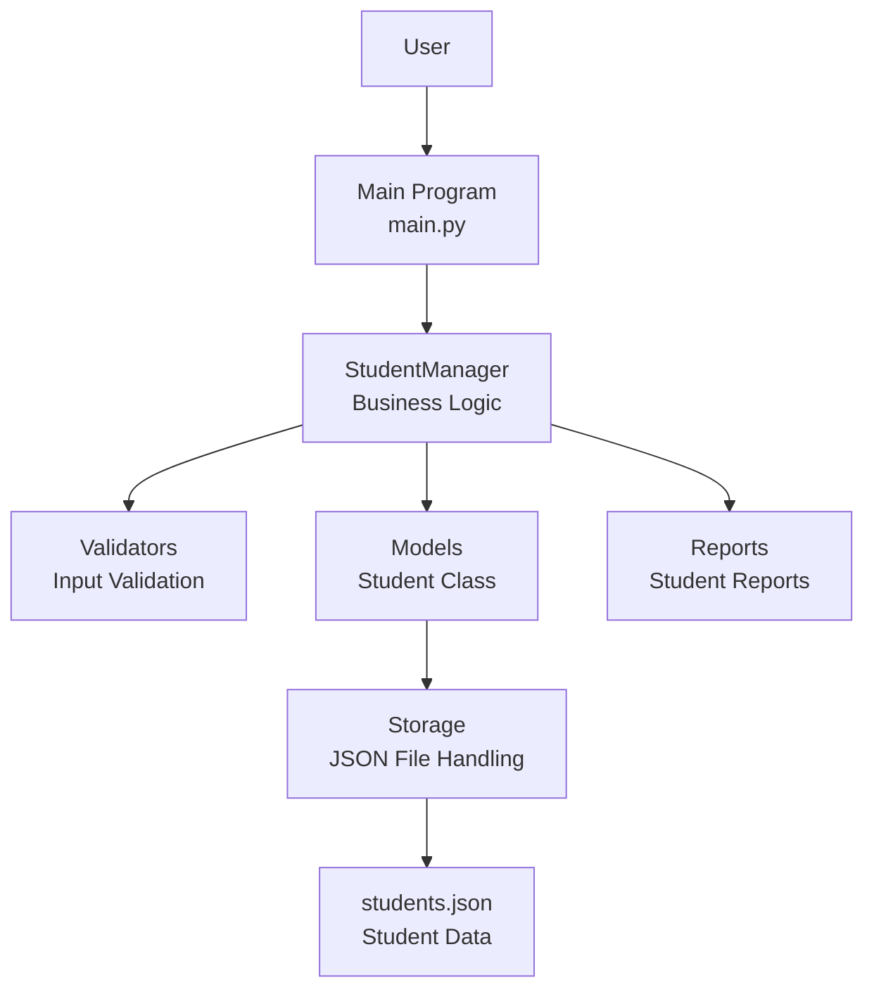

# System Architecture

## Student Management System Architecture

## Architecture Components

| Component | Responsibility |
|---|---|
| Main Program | Provides the menu and handles user input |
| StudentManager | Handles student management operations |
| Models | Defines the Student class |
| Validators | Validates user input |
| Storage | Loads and saves student data |
| Reports | Generates basic student reports |
| students.json | Stores student records permanently |