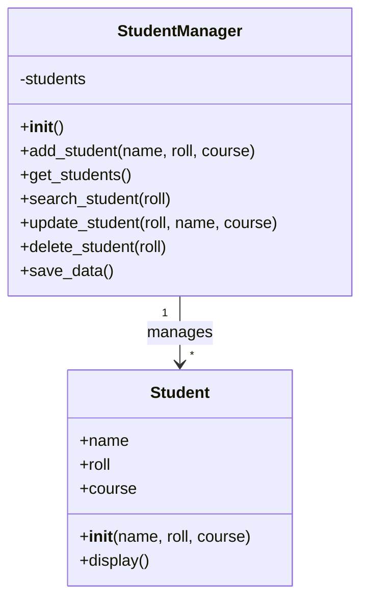

# Class Diagram

## Student Management System

The project mainly uses two classes: `Student` and `StudentManager`.



## Class Details

### 1. Student

The `Student` class is present in `models.py`. It stores the basic information of a student:

- Name
- Roll number
- Course

It also contains a `display()` method for displaying student information.

### 2. StudentManager

The `StudentManager` class is present in `student_manager.py`. It manages the student records and performs the main operations of the application.

Its main functions are:

- Adding a student
- Viewing student records
- Searching by roll number
- Updating student details
- Deleting a student
- Saving student data

## Relationship

One `StudentManager` object can manage multiple `Student` objects.

```text
StudentManager
      │
      ├── Student
      ├── Student
      ├── Student
      └── Student
```

The `StudentManager` also uses the validation and storage modules to validate information and save the records.