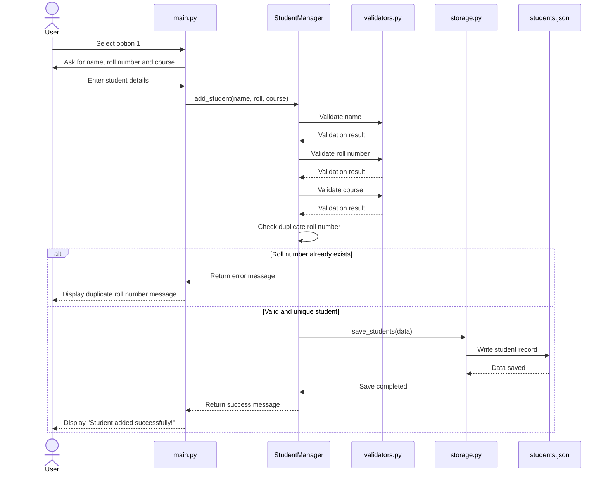

# Sequence Diagram

## Add Student Operation

This sequence shows how the system handles the **1. Add Student** option.

## Sequence Explanation

The **Add Student** process works in the following order:

1. The user selects **option 1** from the main menu.
2. `main.py` asks the user for the student's name, roll number and course.
3. `main.py` sends these details to `StudentManager`.
4. `StudentManager` uses the validation functions to check the entered details.
5. The system checks whether the roll number is already present.
6. If the roll number already exists, an error message is shown.
7. If the details are valid and the roll number is unique, the student is added.
8. The updated data is saved in `students.json`.
9. A success message is displayed to the user.

## Main Components Involved

| Component | Role |
|---|---|
| `main.py` | Takes input and displays messages |
| `StudentManager` | Controls the add-student operation |
| `validators.py` | Validates the entered details |
| `storage.py` | Saves the student data |
| `students.json` | Stores the student records |