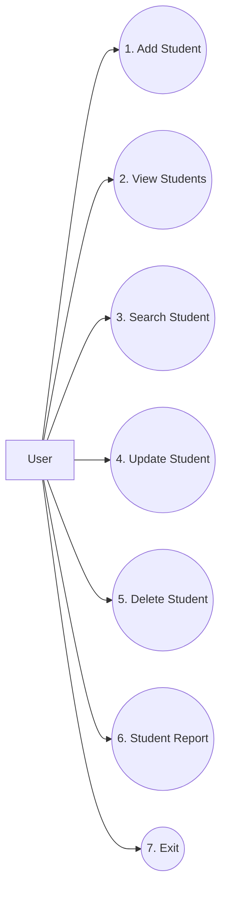

# Use Case Diagram

## Student Management System

The Student Management System has one main user who interacts with the application through the menu shown in `main.py`.



## Use Case Description

| Option | Use Case | User Action |
|---|---|---|
| 1 | Add Student | Enters name, roll number and course |
| 2 | View Students | Views all available student records |
| 3 | Search Student | Enters a roll number to find a student |
| 4 | Update Student | Changes the name or course of an existing student |
| 5 | Delete Student | Removes an existing student record |
| 6 | Student Report | Views total students and course-wise information |
| 7 | Exit | Closes the Student Management System |

## Main Actor

**User:** The user interacts with the system through the menu in `main.py` and performs the available student management operations.

## Basic Use Case Flow

```text
User
  ↓
Open Student Management System
  ↓
Select an option from 1 to 7
  ↓
System performs the selected operation
  ↓
System displays the result
  ↓
Return to Main Menu
  ↓
Select another operation or choose 7 to Exit