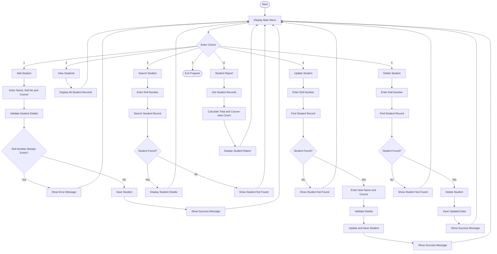

# Student Management System - Workflow

## Program Flow

The program starts by displaying the Student Management System menu. 
The user selects one of the available options from 1 to 7.



## Menu Options

| Option | Operation | What it does |
|---|---|---|
| 1 | Add Student | Adds a new student record |
| 2 | View Students | Shows all saved student records |
| 3 | Search Student | Searches for a student using roll number |
| 4 | Update Student | Changes the name or course of an existing student |
| 5 | Delete Student | Removes a student record |
| 6 | Student Report | Shows total students and course-wise count |
| 7 | Exit | Closes the program |

## How the Workflow Works

1. The program starts and displays the main menu.
2. The user selects an option from **1 to 7**.
3. The selected operation is performed.
4. Required student information is validated.
5. Changes are saved in `students.json` where required.
6. The result is shown to the user.
7. After completing an operation, the program returns to the main menu.
8. When the user selects **7**, the program exits.

## Main Modules Used

```text
main.py
   ↓
student_manager.py
   ↓
├── models.py
├── validators.py
├── storage.py
└── reports.py
   ↓
students.json
```

These modules divide the work of the project into smaller parts and make the program easier to understand and maintain.